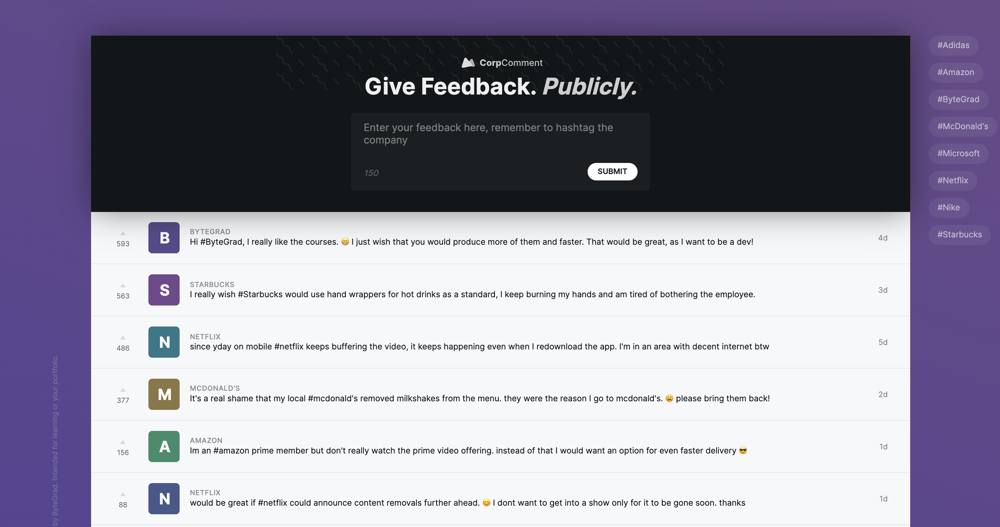

# React CorpComment

React CorpComment created with HtML, CSS, TypeScript and React.

Created during React Tutorial
https://bytegrad.com/app/professional-react-and-nextjs/



## Learnings

- RadixUI Icons
- Controlled Textarea
- Guard statement for validation
- Create an id with new Date().getTime()
- GET API endpoint request with fetch() API
- POST API endpoint request with fetch() API
- optimistic UI update: update data first locally and POST then to the server (assume the server will update the data correctly!)
- adding filter list functionality
- performanceoptimization with useMemo()
- toggle list item
- upvote feature (add 1 on button click)
- prevent event bubbling in the DOM
- disable upvote button on click
- valid and invalid indicators for user feedback (e.g. something went wrong)
- children composition again: prevent prop drilling in TypeScript
- context API again: prevent prop drilling in TypeScript
- problems with context API: no selectors -> rerendering occours even if direct value didn't change (when exposing multiple lists in one context) -> use Zustand

## Install RadixUI Icons

```bash
npm install @radix-ui/react-icons
```

## Install Zustand

```bash
npm install zustand
```

## Typescript

- Primitive Types: number, string, boolean
- Typing props
- Tupels: [number, number, number]
- React.CSSProperties
- Record<string, number> (for key-value types)
- Typing functions in props
- Typing children: React.ReactNode
- JSX.ELement
- Type of set-Function in useState: React.Dispatch<React.SetStateAction<number>>
- Type React.ComponentPropsWithoutRef<"button">
- Rest-Operator (...rest)
- Intersect types (adding additional props to existing type with '&')
- optional chaining

```JS
type User = {
	name: string;
	age: number;
};
...

const [user, setUser] = useState<User | null>(null);

const name = user?.name;
```

- typing useRef, e.g. useRef<HTMLButtonElement>(null)
- generics
- exporting and importing types in seperate files
- using type "unknown"
