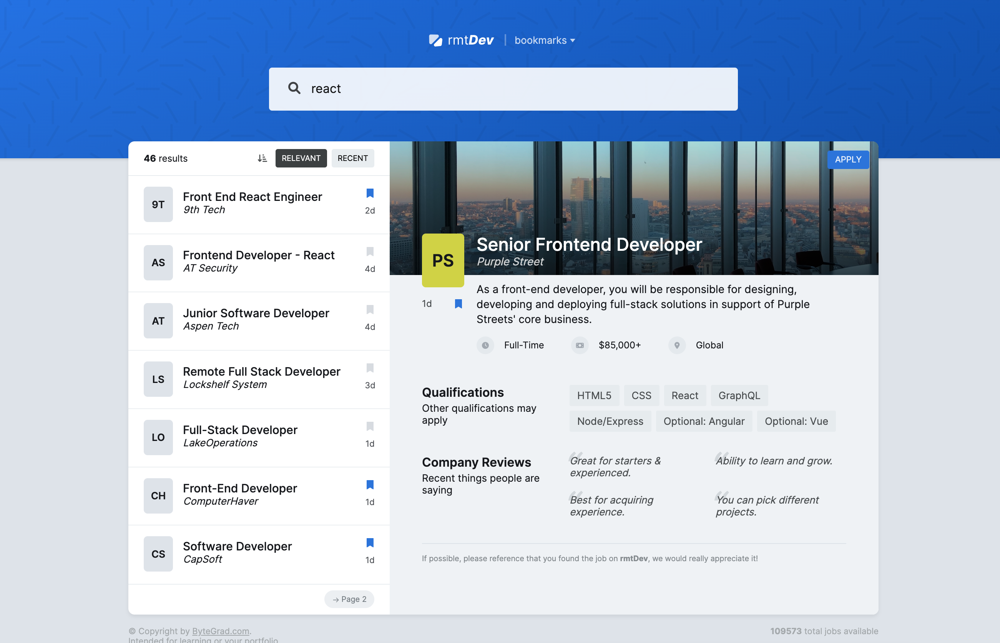
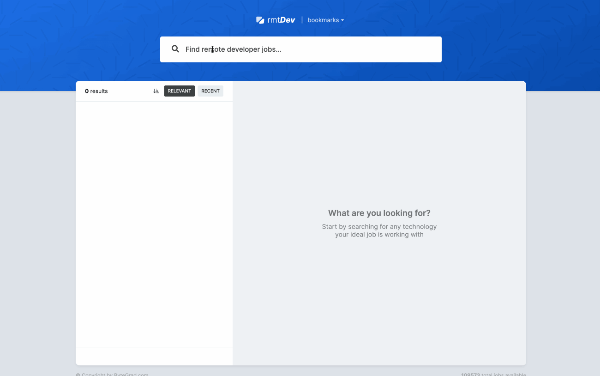

# React Remote Dev

React RmtDev created with HtML, CSS, TypeScript and React.

Created during React Tutorial
https://bytegrad.com/app/professional-react-and-nextjs/





## Learnings

- Search query parameters (parameters after the question mark in an URL) vs path params
- Fetch data: useEffect vs Event Handler
- Fetching data asynchonously from an API in useEffect (create a separate async function for fetching data)
- Show search results (fetched data)
- Typing API response in TypeScript
- Prevent prop drilling: children pattern
- Show spinner while fetching data
- Create a custom hook
- Slice job items with a derived state (pagination)
- Rules of hooks (no conditions) / returning array vs object -> give elements a different name when using the hook (destructuring) -> use array to easily rename variables when destructuring (see useState behaviour)
- type custom hook return value with "as const"
- benefits of data in URL instead of useState: keep track of active job item id -> writing URL with anker href tag and reading URL with useEffect
- use "+" before a variable to convert it to a number!
- fetch active job item details with a custom hook
- use constants in seperate file
- render active job item details
- Display active job item in list
- Display results count
- Return an object from a custom hook -> order of elements does not matter (in an array, it matters!) -> selecting only necessary parts in destructuring possible
- Debounce search results with a useDebounce custom hook
- Using generics in TypeScript
- Add key when there is no id available
- Use React-Query for fetching data
- Use separate function for fetching data
- Type the return value of the fetcher function (API response, Promise) -> Promise<TJobItemApiResponse> as response
- Fix loading state in React-Query
- Handle errors when fetching job item data
- Purify custom hook useJobItems by moving derived state outside of the hook
- Refactor useJobItems to React-Query
- Use short circuiting for slicedJobItems and totalNumberOfJobResults:

```JS
const totalNumberOfJobResults = jobItems?.length || 0;
const slicedJobItems = jobItems?.slice(0, 7) || [];
```

- Show error messages as Toast Message
- Install Toast

```bash
npm install react-hot-toast
```

- Unknown type in TypeScript: check with instanceof / typeof for specific type before using variable, e.g:

```bash
let message;

if (error instanceof Error) {
   message = error.message;
} else if (typeof error === "string") {
   message = error;
} else {
   message = "An error occurred.";
}
```

- Add pagination to the app
- Create a reusable pagination button component
- Client side pagination vs server side pagination
- Add sorting to the app
- Always create new arrays and objects when updating instead of using existing ones
- Create a reusable component for the sorting buttons
- Keep track of bookmarked job item ids with Context API
- Event bubbling: Prevent default / stop propagation
- stopPropagation -> prevent event bubbling upwards
- Persist data in local storage and get it back in initializer function
- Provide a function to initialize useState -> runs only once on mounting
- Type custom hook "useLocalStorage" with Generics
- Implement popover functionality (toggle on button click)
- Reuse a custom hook for popover
- Fetch multiple things in parallel without waterfall with React-Query during loading of the app
- Library "ts-reset" to fix several TypeScript issues
- Close popover on click outside of component by using classname in event handler:

```js
// add an event listener to the document on mounting
useEffect(() => {
  const handleClick = (event: MouseEvent) => {
    // check if user clicked outside of the bookmarks button (by comparing closest with the bookmarks button class or the bookmarks popover class)
    if (
      event.target instanceof HTMLElement &&
      !event.target.closest(".bookmarks-btn") &&
      !event.target.closest(".bookmarks-popover")
    ) {
      setIsOpen(false);
    }
  };

  document.addEventListener("click", handleClick);

  return () => {
    document.removeEventListener("click", handleClick);
  };
}, []);
```

- Close popover on click outside by using UseRef
- Pass a ref to another component with using "forwardRef":

```js
import { forwardRef } from "react";
import { useBookmarksContext } from "../lib/hooks";
import JobList from "./JobList";

// undescore (_) is for props, when not using them
const BookmarksPopover =
  forwardRef <
  HTMLDivElement >
  function (_, ref) {
    const { bookmarkedJobItems, isLoading } = useBookmarksContext();
    return (
      <div ref={ref} className="bookmarks-popover">
        <JobList jobItems={bookmarkedJobItems} isLoading={isLoading} />
      </div>
    );
  };

export default BookmarksPopover;
```

- Create a custom hook useOnClickOutside:

```js
export function useOnClickOutside(
  refs: React.RefObject<HTMLElement>[],
  handler: () => void
) {
  // add an event listener to the document on mounting
  useEffect(() => {
    const handleClick = (event: MouseEvent) => {
      // check if user clicked outside of the bookmarks button (by comparing if current button ref contains event target)
      if (refs.every((ref) => !ref.current?.contains(event.target as Node))) {
        handler();
      }
    };

    document.addEventListener("click", handleClick);

    return () => {
      document.removeEventListener("click", handleClick);
    };
  }, [refs, handler]);
}
```

- Create a portal for the popover with createPortal (so that it sits always on top of all elements) -> place it somewhere else in the DOM
- Hooks: When using a hook, the code is run in isolation from the other instances! -> when a hook is used in multiple places, every time a new useState is created and the useEffect is run again! -> use Context API instead
- Get active id from Context API
- Create multiple contexts for state management in Context API to pull everything out of app component so it is not causing so many rerenders
- ContextProviders do not trigger a rerender of the app every time they rerender because they use the children pattern!
- use the data wraper component pattern to get data and keep JobList reusable
- Memoize derived state with useMemo
- Why and how to memoize context value
- Why and how to useCallback for event handler functions -> useCallback is like useMemo, but for functions

## Clone git starter package

```bash
git clone https://github.com/ByteGrad/starter-rmtdev.git
```
