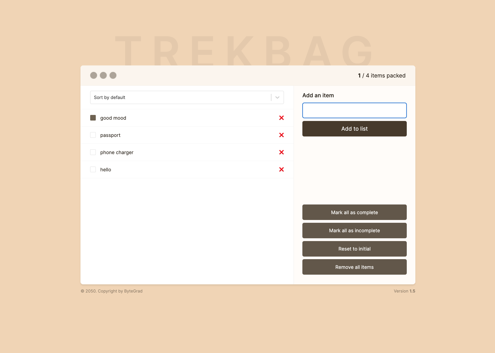

# React Trekbag

React Trekbag created with HtML, CSS and React.

Created during React Tutorial
https://bytegrad.com/app/professional-react-and-nextjs/



## Learnings

- Template literals (with backticks)
- key prop: mapping over array elements
- connect a label to the input (htmlFor)
- displaying items in an item list
- add an item to the item list
- deleting an item from item list onClick
- onSubmit event
- event.preventDefault()
- useState() setter function has access previous items!
- spread operator with objects
- guard statement (early return)
- useRef: get reference to html elements
- best practice: naming props with onEventname
- short circuiting again (&&)
- double negation (!!)
- sorting items
- select component (React-Select)
- LocalStorage: store and load items (persist data)
- useEffect(): deal with eternal system
- JSON.stringify()
- useState() initialization with a function (runs only once)
- useMemo() hook for calculation
- how to avoid prop drilling -> children prop + Context API
- custom hooks
- problem with context API: if a context value changes, all components that use that context value will rerender, even if they don't use the value that changed -> Zustand / Redux as solution
- Zustand with selectors

## Install React-Select component

```bash
npm install react-select
```

## Install Zustand

```bash
npm install zustand
```

### Arrays

- length (number of elements in an array)
- push()
- includes()
- forEach()
- map()
- filter()
- find()
- some()
- objects in arrays
- spread operator
- destructuring arrays

### Objects

- dot notation
- spread operator
- object within an object
- property name is sometimes the same as the property value
- passing objects as function argument
- destructuring objects

### Primitives vs References

- primitives (number, string, boolean)
- references (arrays, objects)

### Short circuiting

- && operator
- || operator

### Functions

- calling other functions in a function
- early return within a function
- keep code DRY -> refactor functions
- callback functions (anonymous functions)
- methods (functions in objects)

### Fetch API

- data in JSON format
- JSON.stringify()
- fetch: asnychronous function
- consuming promises (then() vs async / await)
- GET/POST/PUT/DELETE requests
- try/catch block

```js
fetch("https://jsonplaceholder.typicode.com/todos")
  .then((res) => {
    return res.json();
  })
  .then((data) => {
    console.log(data);
  })
  .catch((error) => {
    console.log(error);
  });
```

```js
const btnEl = document.querySelector(".btn");

// fetch data on button click
const clickHandler = async () => {
  try {
    const res = await fetch("https://jsonplaceholder.typicode.com/todos");
    const data = await res.json;

    // check for valid response
    if (!res.ok) {
      console.log("Problem!");
      return;
    }

    console.log(data);
  } catch (error) {
    console.log(error);
  }
};

btnEl.addEventListener("click", clickHandler);
```

### useEffect with Fetch API

```js
useEffect(() => {
  const fetchProducts = async () => {
    const response = await fetch("https://dummyjson.com/products");
    const data = await response.json();

    console.log(data);
  };

  // call fetch products function once when the component mounts
  fetchProducts();
}, []);
```

### Custom hooks

- custom hook: a function, that uses React hooks in it
- e.g. useQuantity hook:

```js
import { useState, useEffect } from "react";

const useQuantity = () => {
  const [quantity, setQuantity] = useState(0);

  useEffect(() => {
    const fetchProducts = async () => {
      const response = await fetch("https://dummyjson.com/products");
      const data = await response.json();

      setQuantity(data.total);
    };

    // call fetch products function once when the component mounts
    fetchProducts();
  }, []);

  return {
    quantity: quantity,
    setQuantity: setQuantity,
  };

  ...

  // import quantity hook
  import {useQuantity} from "./hooks";

  // use quantity
  const [quantity, setQuantity] = useQuanity();
};
```

### Rules for hooks

- don't use hooks inside loops, condistions, nested functions
- don't use hooks after early return statement
