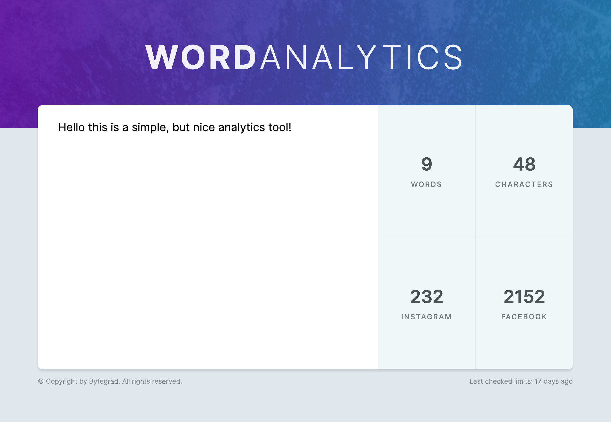

# React Word Analytics

React Word Analytics created with HtML, CSS and React.

Created during React Tutorial
https://bytegrad.com/app/professional-react-and-nextjs/

## Learnings

- Creating separate components
- onChange event
- uncontrolled input/textarea vs controlled input/textarea (managed by useState)
- rerendering a component when state changes
- reusable components
- derive state from already existing state (computed state)
- flow of data (rerendering)
- combine props into prop object
- calculate number of characters and number of words
- manipulate CSS by changing classname
- using constants
