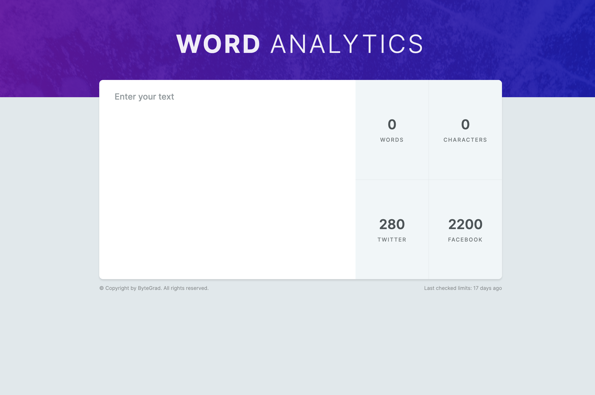

# WordAnalytics

WordAnalytics created with HtML, CSS and JS.

Created during JS Tutorial
https://bytegrad.com/app/professional-javascript/

## Learnings

- 2 background images
- Assign class list
- String length / includes() / split()

### Strings

- length
- includes()
- toUppercase()
- trim()
- substring()
- Chaining

### Numbers

- toFixed()

### Booleans

- Not-Operator (!)

### Arrays

- length
- push()
- includes()
- forEach()
- Objects in arrays

### Objects

- Property name same as property value
- Passing an object as an argument

### Functions

- Calling functions in other functions
- Refactoring function to prevent repeating (DRY)
- Early return / stopping function execution

### Hoisting

- var and function declarations are moved to the top
- Calling functions before declaration is possible

### Timers

- setTimeout()
- setInterval()

### Loops

- forEach
- for

### Fetch API

- Using fetch() with then()
- Catching errors with catch()
- Using fetch with await()

### Manipulating DOM

- querySelector()
- Unfocus buttons with blur()
- Use value for inputs / textarea
- textContent for updating text in HTML element
- innerHTML for updating HTML
- insertAdjacentHTML() for adding HTML
- Event object / addEventListener()
- event.target
- Event bubbling
